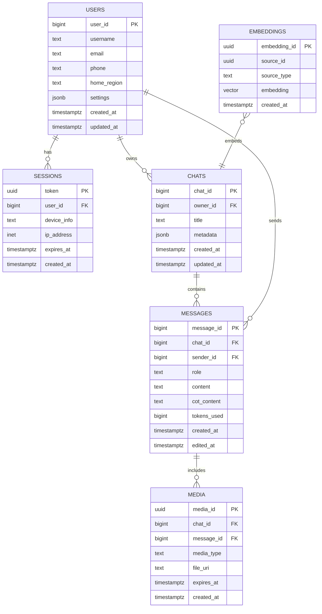
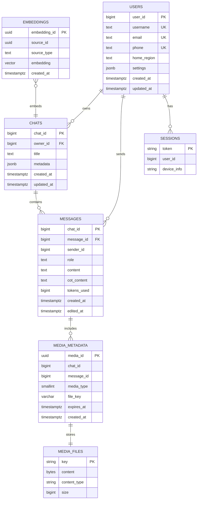
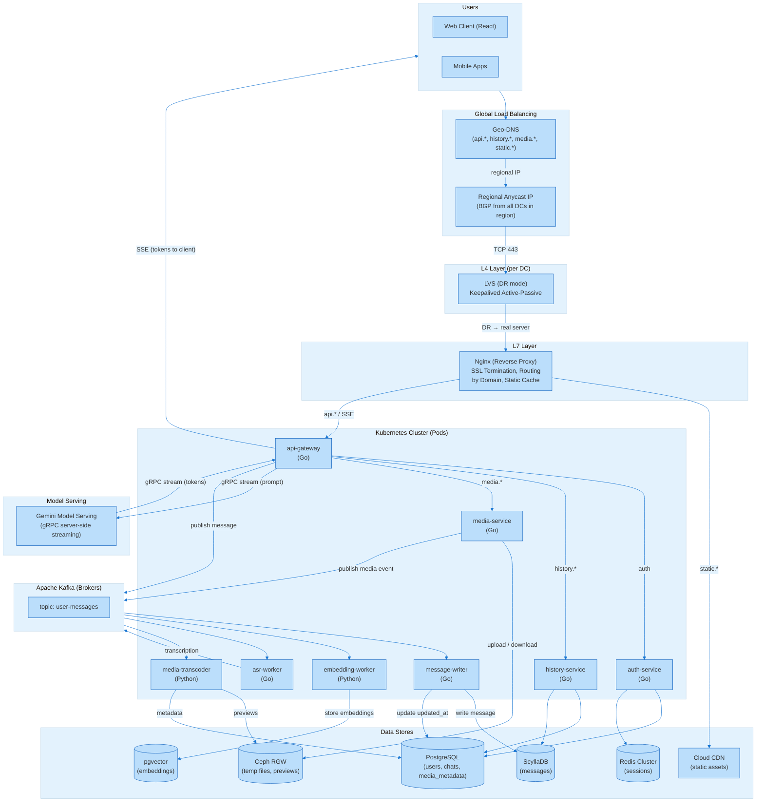

# Проектирование высоконагруженных систем. Gemini

# 1. Тема,целевая аудитория и функционал.
## 1.1 Тема и целевая аудитория

   **Gemini** - чат-бот от Google, основанный на мультимодальных языковых моделях (LLM). Он способен понимать, обрабатывать и генерировать текст, изображения, код, аудио и видео. Gemini интегрирован в сервисы Google (Workspace, Android) для автоматизации задач, поиска информации и творчества. 

### Аудитория

  **Monthly Active Users:** 750 млн [1]

  **Daily Active Users:** 75 мл
  Оффициальными данными по DAU Alphabet не делился, однако известно, что в апреле 2025 года MAU составлял 350 млн, DAU - 35 (10% от MAU) [2], соответственно, можем оценить DAU по состоянию на конец 2025 года в 75 млн.

  **Среднее время на Gemini в день**  
  Длительность каждой сессии на платформе составляет в среднем 6 минут 26 секунд [3]

  **Демография**  
  57,82% пользовательской базы Gemini составляют мужчины, тогда как женщины — 42,18%. Gemini очень популярен среди миллениалов: большинство пользователей находятся в возрасте от 25 до 34 лет, а вторую по величине долю составляют пользователи в возрасте от 18 до 24 лет [3] 

Распределение пользователей по полу:

  

 

Распределение пользователей по возрасту:

  

 

**География** 
Gemini имеет глобальное присутствие, охватывая более 230 стран и 40 языков. Наибольшая концентрация пользователей наблюдается в США, Индии и Бразилии. В отличие от ChatGPT, Gemini показывает более сильные позиции в Азии и на развивающихся рынках благодаря доминированию Android и партнерствам (например, с Samsung) [4]

Распределение пользователей по странам в сравнении с Chat GPT:

  

 

**Использование сервиса на различных устройствах** [5]

  

 

---

## 1.2 Функциональность MVP

1. Ответы на вопросы в текстовом диалоге
2. История диалогов
3. Загрузка и анализ изображений и видео (описание содержимого)
4. Голосовой ввод запросов и голосовые ответы
5. Поиск актуальной информации через интернет (интеграция с Google Search)

   ---
   
 ## 1.3 Ключевые продуктовые решения
1. Единая большая языковая модель (LLM) как ядро: В основе MVP лежит одна из оптимизированных моделей семейства Gemini (например, Gemini Flash), которая обеспечивает понимание контекста, ведение диалога и генерацию связных текстовых ответов, включая фрагменты кода. Это позволяет закрыть основные сценарии общения и помощи одним техническим решением.

2. Встроенная мультимодальность: Модель изначально обучена работать не только с текстом, но и с изображениями. Это даёт возможность пользователю загрузить картинку, а сервис — описать её содержание, ответить на вопросы по ней или извлечь из неё текст, не привлекая отдельные системы компьютерного зрения.

3. Интеграция с поисковой системой (Google Search): Для ответов на вопросы, требующие актуальных данных (новости, факты, события), модель через API обращается к поиску Google. Это позволяет выдавать точную и свежую информацию, дополняя ею сгенерированный ответ и указывая источники.

4. Голосовой интерфейс как отдельный слой: Взаимодействие через голос реализуется за счёт подключения внешних или собственных технологий распознавания речи (ASR) и синтеза речи (TTS). Пользователь говорит — система преобразует речь в текст, передаёт модели, а затем озвучивает текстовый ответ, делая взаимодействие более естественным и удобным.

5. Масштабируемая облачная инфраструктура: Весь сервис разворачивается на платформе Google Cloud с использованием автоматического масштабирования. Это позволяет выдерживать пиковые нагрузки (например, при запуске продукта), обрабатывать большие объёмы пользовательских запросов с минимальной задержкой и обеспечивать отказоустойчивость.

---

# 2. Расчёт нагрузки

## 2.1 Продуктовые метрики

Сводная таблица продуктовых метрик

| Метрика                             | Значение                | Источник
|-------------------------------------|-------------------------|------------
| Monthly Active Users (MAU)          | 750                     | [1]
| Daily Active Users (DAU)            | 75                      | [2]
| Среднее кол-во запросов             | 7                       | [7] (525 млн сообщений / 75 млн DAU)
| Средний размер запроса (текст без медиа) | 500 Б                   | [10], [11]
| Средний размер ответа               | 1500 Б                   | оценка
| Коэффициент рассуждений (Chain of Thought) |	450 Б (30 % от объёма ответа) |	оценка
| Средний размер фото (передача)               | 1 МБ                    | [12], [13]
| Средний размер фото (хранение, сжатое)               | 0,2 МБ                    | WebP/AVIF, адаптивное разрешение
| Средний размер голосовых запросов (передача и хранение)  | 90 КБ                   | Opus / AAC, 30 с, 24 kbps
| Средний размер видео (передача)                | 20 МБ                   | 30 с, HD, исходное качество [12], [13]
| Средний размер видео (хранение, сжатое)                | 2 МБ                   | Перекодирование, битрейт 1–2 Мбит/с, 720p
| Размер эмбеддинга	| 12 КБ	| 3072‑мерный вектор [14]
| Среднее количество сессий           | 1-3                     | см. обоснование ниже
| Срок хранения истории               | 18 месяцев (548 дней) по умолчанию | [6]
| Срок временного хранения медиа	| 48 часов	 | File API Gemini [15]

Gemini мало публикует официальной статистистики, поэтому некоторые показатели были оценены с использованием официальной статистики других LLM, особенно ChatGPT.

### Среднее кол-во сообщений: 
По аналитическим оценкам [7] общее количество сообщений в день составляет 525 млн. Зная DAU, можем получить среднее количество сообщений (promts) в день: 7. 

### Средний размер текстового запроса:
В системах на базе модели Gemini входные данные измеряются в токенах. Согласно документации Gemini API [10], 1 токен соответствует примерно 4 символам текста, а 100 токенов составляют около 60–80 слов. Пользовательские запросы обычно содержат 50–100 токенов по данным о ChatGPT [11], однако стоит отметить, что по исследованиям [9], поведение пользователей LLM примерно одинаковое. Поэтому средний размер prompt можно оценить как 200–400 байт, а с учётом служебных данных — около 500 байт.

### Средний размер фото (передача):
В мультимодальных системах искусственного интеллекта изображения перед обработкой обычно масштабируются до разрешения около 512–1024 px и сжимаются в форматы JPEG или WebP. Согласно исследованиям веб-оптимизации медиа-контента [12, 13], средний размер таких изображений составляет 0.5–1.5 МБ, поэтому для расчётов была принята оценка 1 МБ.

### Средний размер голосовых запросов (передача, хранение):
В мобильных приложениях голос обычно кодируется Opus / AAC, битрейт ≈ 16–24 kbps. Тогда 30 секунд аудио ≈ 90 КБ

### Средний размер видео (передача):
Возьмём среднее значение для видео с битрейтом 4–10 Мбит/с ≈ 20 МБ

### Среднее количество сессий
Как уже было отмечено, поведение пользователей в разных LLM примерно одинаково [10]. Таким образом, количество сессий в день составляет 1-3 [8].

### Распределение запросов по типу контента

| Тип контента в запросе              | Количество в день       | Доля от всех запросов
|-------------------------------------|-------------------------|------------
| Текст без медиа          | 5                  | 0,7143
| Текст + фото          | 1                  | 0,1429
| Текст + видео         | 0,5                  | 0,0714
| Аудио (без текста)        | 0,475                  | 0,0679
| Аудио (с текстом)       | 0,025                  | 0,0036
| Общий текст         | 6,975                  | 0,9964
| Итого        | 7                  | 1,0000

*Примечание: Голосовой ввод в Gemini Live и Android не предполагает отдельного текста, загрузка аудиофайлов с текстовым комментарием — редкий сценарий

## 2.2 Технические метрики

### Расчёт постоянного хранения (на 548 дней)

| Тип данных          | Формула расчёта для 1 пользователя     | Общий объём данных
|---------------------|----------------------------------------|-------------------
| Текстовые запросы   | 6,975 запр. × 548 дн. × 500 Б ≈ 1,9112 МБ    | 1,33 ПБ
| Текстовые ответы	  | 7 запр. × 548 дн. × 1 500 Б	≈ 5,754 МБ      | 4,02 ПБ
| Голосовые ответы	  | 7 запр. × 0,15 × 548 дн. × 180 КБ	≈  103,6 МБ      | 72,36 ПБ
| Рассуждения (CoT)	  | 7 запр. × 548 дн. × 450 Б	≈ 1,7262 МБ             | 1,21 ПБ
| Эмбеддинги          |	7 запр. × 548 дн. × 12 КБ	≈ 46, 032 МБ                    | 32,15 ПБ
| Превью фото	        | 1 запр. × 548 дн. × 0,2 МБ ≈ 109, 6 МБ                     | 76,55 ПБ
| Превью видео	      | 0,5 запр. × 548 дн. × 2 МБ ≈ 548 МБ	                     | 382,77 ПБ

*Примечание: После обработки аудио через ASR (автоматическое распознавание речи) система сохраняет текстовую транскрипцию, которая учтена в компоненте «текстовые запросы» (для голосовых запросов транскрипция становится содержанием запроса). Для последующего отображения истории диалогов используется именно текстовая транскрипция, а не исходный аудиофайл. Исходные аудиофайлы сохраняются временно (48 часов) в соответствии с политикой File API Gemini [15] для обеспечения возможности обработки, после чего удаляются.
Голосовые ответы составляют около 15% от всех ответов, они генерируются дополнительно к текстовым и составляют примерно 180 КБ

Итого - 570,39 ПБ на 548 дней, что в год составляет примерно 380,26 ПБ

### Расчёт временного хранения (48 часов)

| Тип данных          | Формула расчёта для 1 пользователя     | Общий объём данных
|---------------------|----------------------------------------|-------------------
| Фото  | 1 запр. × 2 дн. × 1 МБ ≈ 2 МБ   | 150 ТБ
| Видео	  | 0,5 запр. × 2 дн. × 20 МБ	≈ 20 МБ    | 1500 ТБ
| Аудио (для анализа, не голосовой ввод)	  | 0,025 запр. × 2 дн. × 90 КБ	≈ 0, 0045 МБ             | 337,5 ТБ

Тогда пиковый объём временного хранилища: 1987,5 ТБ ≈ 1,99 ПБ

### Сетевой трафик
Используем коэффицент суточной неравномериности k = 1,3 в силу использования Gemini по всему миру (разные часовые пояса), для разных задач (работа, личные вопросы до и после работы - т.е. на протяжении всего дня) 

Входящий трафик

| Тип трафика      | Суточный объём (Тбайт/сут)   | Средний трафик (Гбит/с) | Пиковый трафик  (Гбит/с)
|------------------|------------------------------|-------------------------|------------------------------
| Текст без медиа         | 75 млн × 5 × 500 Б = 0,188      |  0,188×8 / 86 400 ≈ 0,017              | 0,017×1,3 ≈ 0,023
| Фото + текст             | 75 млн × 1 × (1 МБ + 500 Б) = 75,04	          |    75,04×8 / 86 400 ≈ 6,94                | 6,94×1,3 ≈ 9,02
| Аудио (без текста)            | 75 млн × 0,475 × 90 КБ = 3,21       |    3,21×8 / 86 400 ≈ 0,297               | 0,297×1,3 ≈ 0,386
| Аудио (с текстом)            | 75 млн × 0,025 × (90 КБ + 500 Б) = 0,170         |    0,170×8 / 86 400 ≈ 0,016                 | 0,016×1,3 ≈ 0,020
| Видео + текст           | 75 млн × 0,5 × (20 МБ + 500 Б) = 750,02       |    750,02×8 / 86 400 ≈ 69,45	                | 69,45×1,3 ≈ 90,29
| Итого            |  828,62                       |   76,72                | 99,73

Исходящий трафик

| Тип трафика      | Суточный объём (Тбайт/сут)   | Средний трафик (Гбит/с) | Пиковый трафик  (Гбит/с)
|------------------|------------------------------|-------------------------|------------------------------
| Текстовые ответы       | 75 млн × 7 × 15000 Б =  0,788     | 0,788×8 / 86 400 ≈ 0,073	             | 0,073×1,3 ≈ 0,095
| Голосовые ответы       | 75 млн × 7 × 0,15 × 180 Б = 14,175      | 14,175×8 / 86 400 ≈ 1,312               | 1,312 × 1,3 ≈ 1,706
| Список диалогов       | 75 млн × 1 × 5 КБ = 375      | 375×8 / 86 400 ≈ 34,7               | 34,7 × 1,3 ≈ 45,1
| Загрузка последнего диалога      | 75 млн × 2 × 50 КБ = 7500     | 7500×8 / 86 400 ≈ 694,5             | 694,5 × 1,3 ≈ 902,9
| Загрузка другого диалога       | 75 млн × 0,4  × 50 КБ = 1500     | 1500×8 / 86 400 ≈ 138,9             | 138,9 × 1,3 ≈ 180,6 
| Итого      | 9 389,96    | 869,5	      | 1 130,4

Пояснение:
- Список диалогов (метаданные: ID, название, дата, последняя фраза) оценивается в 5 КБ на запрос.
- Загрузка диалога (20 сообщений с текстом и превью) – 50 КБ.
- Количество операций: список – 1 на DAU; загрузка последнего диалога – 2 на DAU (2 сессии); загрузка другого диалога – 0,4 на DAU (20 % сессий).

### Расчёт RPS (Requests Per Second)

RPS рассчитывается по формуле: RPS = (DAU × Действия в сутки) / 86 400.

| Тип запроса                 | Общее количество запросов в сутки | Средний RPS | Пиковый RPS
|-----------------------------|-----------------------------------|-------------|------------
| Отправка текстового запроса без медиа | 75 × 5 = 375 млн                     |  4 340    | 5 642
| фото + текст запрос              | 75 × 1 = 75 млн                           |  868    | 1 128
| видео + текст запрос             | 75 × 0,5 = 37,5                           |  434       | 564
| Аудио без текста | 75 × 0,475 = 35,625 млн                          |   412       | 	536
| Аудио с текстом | 75 × 0,025 = 1,875 млн                      |   22       | 29
| Список диалогов | 75 млн                      |    	868     | 1 128
| Загрузка последнего диалога | 75 × 2 = 150 млн                      |  1 736       | 2 257
| Загрузка другого диалога | 75 × 0,4 = 30 млн                      |   347       | 451
| Итого                       | 780 млн                           |  9 027      | 11 735

Внутренние вызовы

| Тип запроса             | Общее количество запросов в сутки | Средний RPS | Пиковый RPS
|-----------------------------|-----------------------------------|-------------|------------
| ASR (голос → текст)	 |   75 × 0,475 + 75 × 0,025 = 37,5               |  434   | 564
| TTS (текст → голос)             | 525 × 0,15 = 78,75                          |  911   | 1184
| Google Search API (20% всех запросов)          | 525 × 0,2 = 105                           |  1215       | 1580

#### Сводная таблица метрик по MVP

| Функциональность MVP | Компонент нагрузки | Средний RPS | Пиковый RPS | Суточный объём (ТБ/сут) | Пиковый трафик (Гбит/с) | Хранение (ПБ) | Примечание |
|----------------------|--------------------|-------------|-------------|------------------------|-------------------------|---------------|------------|
| 1. Ответы на вопросы (текстовый диалог)| Отправка запросов (все типы) | 6 076 | 7 899 | 828,6 (входящий) | 99,7 (входящий) | – | Включает текст, фото, видео, аудио |
| | Текстовые ответы | – | – | 0,788 (исходящий) | 0,095 (исходящий) | – | Все ответы |
| | Голосовые ответы (TTS) | 911 | 1 184 | 14,175 (исходящий) | 1,706 (исходящий) | 72,36 (постоянное) | 15 % ответов |
| | Постоянное хранение (текст, эмбеддинги, превью) | – | – | – | – | 497,0 (без TTS) 570,4 (с TTS) | За 18 месяцев на 75 млн DAU |
| 2. История диалогов | Список диалогов | 868 | 1 128 | 375 (исходящий) | 45,1 (исходящий) | – | 1 запрос/пользователь/день, 5 КБ |
| | Загрузка последнего диалога | 1 736 | 2 257 | 7 500 (исходящий) | 902,9 (исходящий) | – | 2 сессии/день, 50 КБ |
| | Загрузка другого диалога | 347 | 451 | 1 500 (исходящий) | 180,6 (исходящий) | – | 20 % сессий, 50 КБ |
| 3. Анализ изображений и видео | Входит в отправку запросов (п.1) | – | – | – | – | – | Обработка на стороне модели |
| 4. Голосовой интерфейс | ASR (голос → текст) | 434 | 564 | – | – | – | Все аудиозапросы (37,5 млн/сут) |
| | TTS (текст → голос) | 911 | 1 184 | – | – | 72,36 (постоянное) | Учтено в п.1 |
| 5. Поиск актуальной информации | Google Search API | 1 215 | 1 580 | 5,6 (исходящий) | 0,65 (исходящий) | – | 20 % запросов, ответ ~75 КБ |
| Временное хранение медиа | Исходные фото, видео, аудио (48 ч) | – | – | – | – | 1,99 ПБ (пик) | Только загруженные файлы, не транскрибируемые |
| Общая нагрузка (все компоненты) | Суммарный RPS | 9 027 | 11 735 | – | – | – | Внешние запросы |
| | Суммарный исходящий трафик | – | – | 9 389,96 | 1 130,4 | – | Без учёта входящего |
| | Постоянное хранение | – | – | – | – | 570,4 | За 18 месяцев (75 млн DAU) |
| | Временное хранение | – | – | – | – | 1,99 | Пиковая ёмкость |

Пояснение: ASR, TTS и Google Search API являются внутренними вызовами и не увеличивают внешний RPS, но учтены в сводке для полноты картины.

---

#  3. Глобальная балансировка нагрузки

## 3.1 Функциональное разбиение по доменам

Для разделения трафика по типам и независимого масштабирования будут использоваться следующие домены:

| Доменное имя | Назначение |
|--------------|------------|
| `api.gemini.google.com` | Основное API: текстовые запросы, загрузка фото/видео/аудио, голосовой ввод (ASR), голосовые ответы (TTS), интеграция с поиском Google, получение ответов модели |
| `history.gemini.google.com` | История диалогов: получение списка диалогов, загрузка содержимого диалога (текст, превью медиа) |
| `media.gemini.google.com` | Передача «тяжёлого» контента: загрузка и скачивание исходных фото, видео, аудио (временное хранение 48 часов) |
| `static.gemini.google.com` | Статические ресурсы: JS, CSS, шрифты, интерфейсные изображения |

## 3.2 Расположение дата‑центров

Локации выбраны с учётом географии пользователей (см. 1 пункт работы)

| ID | Локация | Обслуживаемый регион | 
|----|---------|----------------------|
| DC1 | Майами (США) | Северная (восток) | 
| DC5 | Лос-Анджелес (США) | Северная Америка (запад), Мексика, Центральная Америка | 
| DC2 | Амстердам (Нидерланды) | Европа (северо‑запад), Британия | 
| DC6 | Франкфурт (Германия) | Европа (центр и восток), Ближний Восток, Африка | 
| DC3 | Сингапур | Юго‑Восточная Азия, Индонезия | 
| DC7 | Мумбаи (Индия) | Индия, Шри‑Ланка, Бангладеш | 
| DC4 | Токио (Япония) | Япония, Корея | 

Обоснование: 
- Майами и Лос‑Анджелес — покрытие двух часовых поясов США, разные сейсмические и климатические риски.
- Амстердам и Франкфурт — ключевые узлы европейского интернета 
- Сингапур и Мумбаи — разные подрегионы Азии
- Токио – высокая концентрация пользователей в Японии и Корее.

Логика размещения данных:  
- Каждый ДЦ хранит данные пользователей своего региона (история диалогов, эмбеддинги, превью).  
- Привязка к «родному» ДЦ определяется при регистрации по геолокации; при длительном перемещении возможна миграция данных.  
- Исходные загружаемые медиа хранятся временно (48 часов) в том ДЦ, где пользователь их загрузил.

## 3.3 Распределение запросов по ДЦ

Нагрузка распределяется пропорционально доле пользователей в регионах. Пиковый внешний RPS 11 735 распределяется следующим образом:

| Регион (ДЦ) | Доля пользователей | Пиковый RPS на регион | Распределение внутри региона |
|-------------|--------------------|------------------------|------------------------------|
| Америка (DC1, DC5) | 30 % | 3 520 | DC1: 1 760, DC5: 1 760 (50/50) |
| Европа (DC2, DC6) | 20 % | 2 347 | DC2: 1 173, DC6: 1 174 (50/50) |
| Азия (DC3, DC7) | 25 % | 2 934 | DC3: 1 467, DC7: 1 467 (50/50)   |
| Япония/Корея (DC4) | 15 % | 1 760 | DC4: 1 760 |
| Остальные регионы (проксируются) | 10 % | 1 174 | Проксируются через ближайший ДЦ |
| Итого | 100 % | 11 735 | |

## 3.4 Схема балансировки

Применяется двухуровневая схема.

**1 уровень (Geo‑based DNS)**

Для каждого региона определяется единый Anycast‑адрес, который объявляется из всех дата‑центров этого региона через BGP. Geo‑DNS возвращает этот адрес всем пользователям из соответствующего региона.

| Домен | Что отправляется / запрашивается | Куда направляется |
|-------|----------------------------------|-------------------|
| `api.gemini.google.com` | Основные API‑запросы | региональный Anycast‑адрес  |
| `history.gemini.google.com` | Получение списка диалогов, загрузка диалога | региональный Anycast‑адрес|
| `media.gemini.google.com` | Загрузка и скачивание исходных медиа | региональный Anycast‑адрес |
| `static.gemini.google.com` | Статические ресурсы | Anycast‑адрес Cloud CDN  |

**2 уровень – выбор дата‑центра внутри региона (Anycast + BGP)**

Региональный Anycast‑адрес объявляется через BGP из всех дата‑центров этого региона (например, для Америки – из DC1 и DC5). BGP‑маршрутизация интернет‑провайдеров автоматически направляет пользователя в ближайший по сетевой топологии дата‑центр. Это происходит без участия DNS и обеспечивает:

Минимальную задержку (клиент попадает в географически ближайший ДЦ).

Отказоустойчивость: при сбое ДЦ его BGP‑объявление исчезает, и трафик автоматически переключается на другой ДЦ региона (время переключения – секунды).

**3 уровень (внутреннее проксирование)**

Если данные пользователя хранятся не в том ДЦ, куда его направил DNS, используется проксирование:

1. Ближайший ДЦ принимает соединение, из токена определяет `user_id`.
2. По локальному кешу реестра пользователей находится ID «родного» ДЦ пользователя.
3. Запрос проксируется в «родной» ДЦ по внутренним каналам Google Cloud (используется Traffic Director).
4. Ответ возвращается клиенту через тот же ДЦ, который принял соединение.

## 3.5 Механизмы регулировки трафика между ДЦ

| Механизм | Описание |
|----------|----------|
| BGP Anycast | Региональный IP объявляется из всех ДЦ региона. При сбое ДЦ его BGP‑объявление исчезает, трафик автоматически перераспределяется на другие ДЦ региона.|
| Active Health Checks | Мониторинг задержки, доступности, уровня ошибок. При превышении порогов ДЦ выводится из DNS и из пула проксирования. |
| Rate Limiting | Лимиты RPS на пользователя и на ДЦ для защиты от перегрузок. |
| Canary‑релизы | Новые версии моделей разворачиваются сначала в одном ДЦ, трафик переключается постепенно. |

---

# 4. Локальная балансировка нагрузки

## 4.1 Схема балансировки

### 4.1.1 Уровень L4 (транспортный уровень)

На первом уровне используется балансировка на транспортном уровне для распределения входящего TCP‑трафика между балансировщиками уровня L7.

| Параметр | Описание |
|----------|----------|
| Реализация | LVS (Linux Virtual Server) в режиме Direct Routing (DR) |
| Режим работы | Входящие пакеты направляются на LVS, который перенаправляет их на один из узлов L7. Исходящий трафик от L7 идёт напрямую клиенту, минуя LVS, что снижает нагрузку на балансировщик. |
| Резервирование | Схема N × 2. Keepalived обеспечивает автоматическое переключение Virtual IP (VIP) на резервный узел при отказе основного. |

### 4.1.2 Уровень L7 (прикладной уровень)

На втором уровне выполняются SSL‑терминация, проверка заголовков и маршрутизация запросов к соответствующим микросервисам (API, история, медиа, статика).

| Параметр | Описание |
|----------|----------|
| Реализация | Кластер серверов NGINX (reverse proxy) |
| Функции | SSL Termination, балансировка по бэкендам, кэширование статики |
| Оптимизация | Включены session tickets для ускорения повторных TLS‑соединений; keepalive_timeout увеличен до 315 с, keepalive_requests до 1 000 000 для минимизации накладных расходов на установку соединений |
| Резервирование | Схема N + 1 |

## 4.2 Расчёт количества балансировщиков

Расчёт выполнен для наиболее загруженного дата‑центра (Америка/Япония, доля 15 % от глобальной нагрузки) в «худшем» случае. Исходные данные получены из разделов 2.2 и 3.3.

Пиковый входящий трафик: 99,73 × 0,15 ≈ 14,96 Гбит/с

Пиковый исходящий трафик: 1 130,4 × 0,15 ≈ 169,56 Гбит/с

Суммарный трафик через балансировщики L7: 14,96 + 169,56 ≈ 184,5 Гбит/с

Пиковый RPS: 11 735 × 0,15 ≈ 1 760 запросов/с

### 4.2.1 Расчёт узлов L4

Целевая конфигурация – серверы с сетевыми интерфейсами 100 Гбит/с. Ограничитель – пропускная способность канала (входящий трафик).

Расчёт активных узлов:

14,96 Гбит/с ÷ 100 Гбит/с = 0,15 → 1 сервер

С учётом резервирования по схеме N × 2 (на каждый активный узел – резервный) общее количество узлов L4 составит:

1 × 2 = 2 сервера

### 4.2.2 Расчёт узлов L7

Узлы L7 конфигурируются с 16 CPU и сетевыми интерфейсами 100 Гбит/с. Учитываются два ограничителя: пропускная способность и производительность SSL‑терминации.

По пропускной способности:

184,5 Гбит/с ÷ 100 Гбит/с = 1,85 → 2 сервера

По производительности SSL‑терминации:

Интенсивность новых TLS‑соединений (CPS) в худшем случае может достигать величины RPS (при отсутствии keep‑alive). Согласно тестам NGINX [9], сервер с 16 ядрами обрабатывает 6 676 SSL‑соединений в секунду.

1 760 RPS ÷ 6 676 CPS ≈ 0,26 → 1 сервер

Более строгим ограничением является пропускная способность (2 сервера). Выбираем худший случай:

Активных узлов = 2

С учётом резервирования по схеме N + 1:

2 + 1 = 3 сервера

## 4.3 Итоговая конфигурация оборудования (на один ДЦ)

| Уровень | Количество узлов | Конфигурация узла | Тип резервирования |
|---------|------------------|-------------------|---------------------|
| L4 | 2 | CPU 8 ядер, NIC 100 Гбит/с, LVS + Keepalived | N × 2 |
| L7 | 3 | CPU 16 ядер, NIC 100 Гбит/с, NGINX | N + 1 |

---

# 5. Логическая схема базы данных

## 5.1 Схема БД

## 5.2 Таблица с описанием таблиц

| Таблица | Описание | Размер строки | Количество строк | Размер таблицы | Нагрузка на запись (QPS, пик) | Нагрузка на чтение (QPS, пик) |
|---------|----------|----------------|------------------|----------------|------------------------------|------------------------------|
| users | Профили пользователей | `user_id`(8) + `username`(32) + `email`(64) + `phone`(20) + `home_region`(10) + `settings`(512) + `created_at`(8) + `updated_at`(8) ≈ 662 Б | 750 млн | 496 ГБ | 5 800 | 86 800 |
| sessions | Активные сессии | `token`(16) + `user_id`(8) + `device_info`(100) + `ip_address`(16) + `expires_at`(8) + `created_at`(8) ≈ 156 Б | 150 млн | 23,4 ГБ | 8 600 | 210 000 |
| chats | Личные диалоги | `chat_id`(8) + `owner_id`(8) + `title`(64)  + `metadata`(256) + `created_at`(8) + `updated_at`(8) ≈ 353 Б | 15 млрд | 5,3 ТБ | 15 000 | 175 000 |
| messages | Сообщения (запросы и ответы) | `message_id`(8) + `chat_id`(8) + `sender_id`(8) + `role`(1) + `content`(500) + `cot_content`(650) `tokens_used`(8) + `created_at`(8) + `edited_at`(8) ≈ 553 Б | 287 млрд | 158 ПБ | 312 500 | 1 041 666 |
| media | Медиафайлы (превью и метаданные) | `media_id`(16) + `chat_id`(8) + `message_id`(8) + `media_type`(1) + `file_uri`(256)  + `expires_at`(8) + `created_at`(8) ≈ 570 Б | 61,5 млрд | 12,3 ПБ (превью) + 35 ТБ (метаданные) | 114 600 | 143 200 |
| embeddings | Векторные представления | `embedding_id`(16) + `source_id`(16) + `source_type`(1) + `embedding`(12 288 Б) + `created_at`(8) ≈ 12,3 КБ | 287 млрд | 3,5 ПБ | 1 300 000 (асинхронно) | 520 000 |

### Требования к консистентности:

Strict Consistency: users, sessions, chats, messages

Eventual Consistency: media, embeddings

# 6. Физическая схема базы данных

## 6.1. Физическая схема базы данных

### Описание таблиц

| Таблица | Назначение | Ключ шардирования | СУБД |
| :--- | :--- | :--- | :--- |
| users | Профили пользователей | `user_id` | PostgreSQL |
| sessions | Активные сессии | `token`  | Redis |
| chats | Метаданные диалогов | `user_id` | PostgreSQL |
| messages | Тексты сообщений  | `chat_id` | ScyllaDB |
| media_metadata | Метаданные медиафайлов | `chat_id` | PostgreSQL |
| embeddings | Векторные представления сообщений | `message_id` | pgvector |
| media_files | Бинарные данные медиа | `key` | Ceph RGW  |

## 6.2. Выбор СУБД и хранилищ

| Компонент данных | СУБД / Хранилище | Обоснование выбора |
| :--- | :--- | :--- |
| users, chats, media_metadata | PostgreSQL | Для users, chats и media_metadata выбран PostgreSQL, а не NoSQL, т.к. эти таблицы требуют строгой согласованности: ACID‑транзакции исключают появление пустых диалогов, битых ссылок на медиа и неконсистентных данных даже при сбоях серверов. Колоцированное шардирование по user_id оставляет JOIN локальным, поэтому любой составной запрос, например, получение списка чатов с сортировкой по дате последнего сообщения, выполняется на одном узла и реляционная модель позволяет строить для него эффективные составные индексы, что даёт мгновенное получение данных. Суммарный размер индексов PostgreSQL (4,5 ТБ) после шардирования даёт в крупнейшем дата‑центре DC5 (доля 15 %, 2 шарда) около 345 ГБ на шард. Сервер PostgreSQL с 256 ГБ ОЗУ вмещает в память весь горячий набор индексов, так как в каждый момент активно востребована лишь часть данных. Остальные страницы индекса загружаются с быстрых NVMe-дисков при необходимости. Поэтому чтение списка чатов и поиск по email происходят мгновенно, без обращений к диску. |
| messages | ScyllaDB | Высокие RPS записи/чтения, партиционирование по chat_id |
| embeddings | pgvector | Для семантического поиска по истории и контексту модели |
| sessions | Redis | Низкая задержка, TTL для сессий |
| media_files | Ceph RGW | Хранение содержимого файлов (фото, видео) в объектном хранилище |

## 6.3. Индексы

| Таблица | Поля индекса | Тип | Размер | Обоснование |
|---------|---------------|-----|--------|-------------|
| users | user_id | B-Tree (Primary Key) | 15 ГБ | Уникальная идентификация пользователя, быстрый доступ по ID. |
| users | email | Unique B-Tree | 44 ГБ | Быстрый поиск при аутентификации, гарантия уникальности email. |
| users | phone | Unique B-Tree | 21 ГБ | Аутентификация по номеру телефона, уникальность. |
| chats | chat_id | B-Tree (Primary Key) | 290 ГБ | Прямой доступ к чату по идентификатору. |
| chats | (user_id, updated_at DESC) | Composite B-Tree | 500 ГБ | Получение списка диалогов пользователя с сортировкой по дате последнего обновления. |
| media_metadata | media_id | B-Tree (Primary Key) | 1,8 ТБ | Уникальная идентификация медиафайла. |
| media_metadata | (chat_id, message_id) | B-Tree | 1,8 ТБ | Быстрый поиск превью, прикреплённых к конкретному сообщению в чате. |
| messages | (chat_id, message_id) | Partition Key + Clustering Key DESC | включён в объём таблицы | ScyllaDB физически упорядочивает данные по этому ключу: `chat_id` гарантирует локальность всех сообщений чата на одном узле, `message_id` с сортировкой по убыванию позволяет мгновенно получить последние N сообщений (LIMIT 50). Отдельный индекс не требуется. |
| embeddings | embedding_id | B-Tree (Primary Key) | 8,5 ТБ | Первичный ключ для 287 млрд записей. |
| embeddings | embedding | IVF_FLAT (ANN) | 350 ТБ | Приближённый поиск ближайших соседей (ANN) по косинусному расстоянию для семантического поиска. |
| media_files | key (путь к объекту) | Внутренний индекс Ceph (omap) | 10 ТБ | Ceph автоматически индексирует объекты для list‑операций; в нашей базе отдельный индекс не создаётся. Размер оценён для планирования ёмкости. |

Для ScyllaDB и Ceph индексы являются частью их внутреннего устройства и не требуют отдельных структур в базе данных.

## 6.4. Шардирование и резервирование

Шардирование позволит поделить общий размер индекса на количество шардов, и каждый узел будет хранить только свою часть. Это позволит держать рабочий набор данных и индексы в оперативной памяти.

| Компонент | Стратегия шардирования / партиционирования | Схема резервирования | Цель |
| :--- | :--- | :--- | :--- |
| PostgreSQL | Шардирование по `user_id` с использованием Citus или ручного прокси. Данные пользователя и его чаты локализованы на одном шарде. | Master-Replica (1 Master + 2 Replica). Запись в мастер, чтение с реплик. Если главный упал — копия становится главной  | Все запросы в рамках сессии пользователя обслуживаются локально, без распределённых транзакций. Активный набор данных и индексы (около 60 ГБ на шард) помещаются в RAM. |
| ScyllaDB | Partition Key = `chat_id`. Каждый чат целиком лежит на одном наборе узлов (vnodes). | Данные хранятся на трех узлах в разных стойках. Данные надежно защищены при любом падении узла | Чат со всей историей лежит на одном наборе узлов, чтение последовательное и без межузловых запросов. |
| Redis | Redis Cluster. Ключи распределены по слотам равномерно (например, `session:{token}`). | Master-Slave. Каждый мастер имеет минимум одного реплицирующего слейва. При падении мастера слейв автоматически повышается оркестратором кластера. | Все сессии хранятся в оперативной памяти, шардирование удерживает объём на одном узле в разумных пределах. | 
| Ceph RGW | Шардирование на уровне бакетов: `bucket = user_id % N`. | Данные реплицируются между регионами. | Равномерное распределение объектов по OSD, горячие данные кэшируются на SSD. |

## 6.5. Клиентские библиотеки и балансировка подключений

| СУБД | Библиотека | Балансировщик / Прокси | Описание |
| :--- | :--- | :--- | :--- |
| PostgreSQL | `pgx` | PgBouncer | Запросы на чтение направляются на реплики, на запись идут на мастер за счёт PgBouncer, который держит пул соединений с мастером и репликами.  |
| ScyllaDB | `gocql` | Встроенный Token-Aware Policy | Драйвер сам вычисляет узел-владелец партиции `chat_id` и отправляет запрос напрямую, минуя прокси. |
| Redis | `go-redis` | Встроенный Cluster Client | Клиент кэширует карту слотов и направляет команды на нужный мастер без промежуточных прокси. |
| Ceph RGW | `minio-go` | Cloud CDN | Раздача медиафайлов осуществляется через Cloud CDN. |

## 6.6. Схема резервного копирования

| Хранилище | Метод бэкапа | Комментарий |
| :--- | :--- | :--- | 
| PostgreSQL | Полный бэкап раз в сутки | Возможность восстановления на любую дату |
| ScyllaDB | Snapshot раз в 12 часов | Оптимальная периодичность |
| Redis | RDB каждые 30 мин, AOF каждую секунду | Обеспечивается минимальная потеря сессий |
| Ceph RGW | Георепликация | Непрерывно | Георепликация защищает от потери ДЦ |

# 7. Алгоритмы

## Алгоритм потоковой обработки мультимодальных сообщений (Ingest & SSE Streaming)

1. Блок системы: Backend API Gateway / Message Processor.

2. Постановка задачи: Пользователь отправляет сообщение, которое может содержать текст, изображение, аудио или видео. Система должна:
   - Временно сохранить исходные бинарные файлы (до 48 ч) для последующей обработки.
   - Обеспечить распознавание речи (ASR) для голосовых сообщений.
   - Передать контент LLM (с превью для медиа).
   - Сгенерировать ответ модели и вернуть его клиенту в реальном времени.
   - Сохранить результат в постоянной истории диалога и обновить метаданные чата для корректного отображения списка диалогов.

3. Исходные данные: `user_id`, `chat_id`, `text_content`, `media_files[]`.

4. Алгоритм:

  a) Ingest (приём медиа):  
      Клиент загружает медиафайлы на выделенный домен `media.gemini.google.com`. Сервер сохраняет исходные файлы во временный бакет Ceph RGW (TTL 48 часов), генерирует `media_id` и возвращает его клиенту.

  b) Pre-Processing (асинхронная обработка):  
      При получении нового сообщения в API создаётся событие и отправляется в Apache Kafka. Независимые воркеры обрабатывают медиа:
      - ASR Worker: Если в сообщении есть аудио, воркер извлекает файл из временного бакета, вызывает Google Speech-to-Text API, преобразует речь в текст и публикует результат в топик `user-messages`
      - Media Transcoder: Для загруженных фото и видео создаются сжатые превью (изображения в WebP до 200 КБ, видео в VP9 до 2 МБ). Превью сохраняются в постоянный бакет Ceph RGW. Метаданные о медиафайлах (включая ключи к превью) записываются в таблицу `media_metadata` (PostgreSQL).

   c) Model Inference (взаимодействие с LLM):  
      После завершения предобработки (или параллельно, если медиа не требует преобразования) запрос, содержащий текст и ссылки на превью, направляется в сервис Gemini Model Serving.

   d) Ответ модели (SSE Streaming):
      Клиент удерживает открытое HTTP-соединение с API-сервером.  
      Модель генерирует ответ токен за токеном. Каждый токен немедленно отправляется клиенту в виде фрагмента данных через Server-Sent Events (SSE). Это минимизирует воспринимаемую задержку.

   e) Write Path (сохранение в постоянную историю): 
      - После завершения генерации полный текст ответа, включая цепочку рассуждений (`cot_content`) и метаданные, асинхронно записывается в таблицу `messages` (ScyllaDB).  
      - Chat Metadata Update: Параллельно через Kafka воркер обновляет таблицу `chats` (PostgreSQL) для данного чата: полям `updated_at` присваивается текущая временная метка.

5. Обоснование: 
   - Использование Kafka в качестве шины событий гарантирует надёжную доставку заданий на обработку и сохранение сообщений даже при пиковых нагрузках и временных сбоях сервисов.  
   - SSE идеально подходит для одностороннего потока генерации текста.  
   - Асинхронное обновление `chats.updated_at` исключает необходимость в тяжелых JOIN-запросах при загрузке списка диалогов.

6. Влияние на схему БД:
   Потребовалось разделение хранилища медиа на временное и постоянное (реализовано разными бакетами Ceph с разными политиками жизненного цикла). Таблица `chats` содержит поля `updated_at` для эффективного получения списка диалогов.

## Алгоритм SSE Streaming (потоковая передача ответа модели)

1. Блок системы: API Gateway / SSE Handler.

2. Постановка задачи:
   
  После того как мультимодальный запрос был обработан и передан модели, сервер должен возвращать пользователю генерируемый ответ токен за токеном в реальном времени, минимально увеличивая воспринимаемую задержку. Клиент должен непрерывно получать фрагменты текста до завершения генерации, корректно обрабатывать обрывы соединения и отображать результат.

3. Исходные данные:

- Открытое HTTP-соединение от клиента, установленное на эндпоинт `/v1/chat/stream`.  
- Поток токенов от сервиса Gemini Model Serving (gRPC server-side streaming).  
- Идентификатор запроса `request_id` и контекст сессии пользователя.

4. Алгоритм:
   
  - Инициация стриминга клиентом
     
   Клиент отправляет POST-запрос на `api.gemini.google.com/v1/chat/stream` с телом, содержащим обработанное сообщение (текст, ссылки на превью медиа, `chat_id`). Заголовки: `Accept: text/event-stream`, `Cache-Control: no-cache`. Соединение удерживается открытым.

  - Проксирование запроса к модели
   API Gateway, приняв запрос от клиента, открывает gRPC stream к Gemini Model Serving и передаёт подготовленный промпт. Внутреннему стриму назначается тот же `request_id`.

  - Установка SSE-соединения с клиентом
     
   API-сервер формирует HTTP-ответ с заголовками:

   Content-Type: text/event-stream
   Cache-Control: no-cache
   Connection: keep-alive
   X-Request-Id: <request_id>
  
   Тело ответа начинает передаваться по мере поступления данных от модели.

  - Потоковая отправка токенов (SSE события)
     
   При получении очередного токена от модели (через gRPC stream) сервер:
   
    a) Упаковывает токен в JSON-фрагмент: `{"token": "частичный_текст", "finish_reason": null}`.
    
    b) Отправляет клиенту строку формата SSE:  `data: {"token": "Сегодня", "finish_reason": null}`.
     
    c) Если модель возвращает несколько токенов за один вызов gRPC, каждый токен отправляется отдельным SSE-событием.

  - Обновление интерфейса клиентом
    
   Клиентский JavaScript EventSource при получении каждого события дополняет отображаемый текст новым токеном. Пользователь видит, как ответ генерируется в реальном времени.

  - Завершение генерации
    
   Когда модель заканчивает генерацию (финальный токен с `finish_reason: "stop"`), сервер отправляет клиенту специальное событие:

   data: [DONE]
   
   и закрывает соединение. Клиент считает ответ завершённым и активирует UI-элементы (например, кнопки «Скопировать», «Перегенерировать»).

  - Обработка ошибок и обрывов соединения
    
   a) При ошибке на стороне модели (например, превышение лимита токенов) сервер отправляет SSE-событие с полем `error` и закрывает стрим.
   
   b) Если соединение с клиентом обрывается до завершения, сервер прекращает gRPC-стрим к модели и освобождает ресурсы. Клиент при обнаружении разрыва может отобразить сообщение о сетевой ошибке и предложить повторную отправку.
   
   c) Для контроля состояния соединения используются keep-alive комментарии SSE: каждые 15 секунд сервер отправляет `: ping\n\n`, чтобы предотвратить закрытие простоя прокси-серверами.

5. Обоснование
   
   Server-Sent Events (SSE) оптимальны для однонаправленного потокового вещания текста от сервера к клиенту. В отличие от WebSocket, SSE проще в реализации, нативны для HTTP, не требуют ручного управления фреймами и легко проксируются стандартными балансировщиками. Потоковая выдача токенов сокращает Time To First Byte (TTFB) и позволяет пользователю начинать чтение ответа до его полной генерации, что критически важно для длинных ответов и удержания вовлечённости. gRPC stream обеспечивает эффективное внутреннее взаимодействие с моделью с минимальными накладными расходами на сериализацию.

6. Влияние на схему БД
   
  Полный текст ответа вместе с метаданными сохраняется в хранилище `messages` (ScyllaDB) асинхронно уже после завершения SSE-стрима (см. алгоритм потоковой обработки мультимодальных сообщений). Таким образом, сам механизм SSE не вносит изменений в логическую или физическую модель данных.

# 8. Технологии

| Технология | Область применения | Обоснование |
| :--- | :--- | :--- |
| TypeScript + React | Веб-клиент (Frontend) | Статическая типизация TypeScript снижает количество ошибок в коде, а компонентная модель React с виртуальным DOM эффективно обновляет список чатов и историю переписки без перерисовки всего интерфейса |
| Kotlin / Swift | Мобильные клиенты (Android / iOS) | Нативная разработка под Android и iOS |
| Golang | Backend Core Services (API Gateway, History, Media Proxy) | Низкое потребление памяти, отличная работа с конкурентностью (горутины) |
| Python (FastAPI / Ray) | Model Serving Wrapper и оркестратор| Стандарт ML-инженерии. Позволяет использовать нативные биндинги для PyTorch без накладных расходов на сериализацию в другие языки. |
| Nginx | L7-балансировка, SSL Termination | Стандарт индустрии для реверс-проксирования и распределения запросов по микросервисам |
| Apache Kafka | Брокер сообщений | Гарантия доставки событий и сохранение порядка сообщений внутри чата через partition key |
| Kubernetes | Оркестрация контейнеров | Автоматизация деплоя и масштабирования |
| ScyllaDB | Основное хранилище истории сообщений | NoSQL-решение, способное выдерживать пиковую нагрузку записи/чтения|
| Ceph RGW | Объектное хранилище медиафайлов | Распределённое объектное хранилище с S3-совместимым API (RGW) для хранения фото и видео |
| Prometheus | Логгирование, мониторинг | Стандарт для сбора метрик |
| Grafana | Визуализация метрик для мониторинга | Стандарт для визуализации метрик |

# 9. Обеспечение надёжности

| Компонент системы | Метод обеспечения надёжности |
|-------------------|------------------------------|
| LVS (L4)| Резервирование Active–Passive с Keepalived. Виртуальный IP переходит на резервный узел при отказе основного. |
| Nginx (L7) | Резервирование Active–Active (N+1). Горизонтальное масштабирование кластера реверс-прокси; автоматическое исключение узла при ошибках health-check. |
| PostgreSQL | Master–Slave репликация. WAL-архивация с возможностью Point-in-Time Recovery. Шардирование по `user_id`, данные пользователя и его чаты локализованы на одном шарде. |
| ScyllaDB | Распределённая архитектура с фактором репликации RF=3. Автоматическое перераспределение данных при выходе узла. Каждый чат полностью лежит на одном наборе vnodes. |
| Redis | Redis Cluster: для каждого слота выделены мастер и минимум одна реплика в разных стойках. Автоматический failover с повышением реплики до мастера. |
| Apache Kafka | Гарантия доставки через механизм подтверждений и хранения смещений. При падении воркера он после перезапуска продолжает чтение партиции с последнего закоммиченного смещения. |
| Ceph RGW | Erasure Coding (8+3) позволяет восстановить данные при отказе нескольких дисков/узлов без полного дублирования. Непрерывная георепликация между региональными кластерами. |
| Микросервисы (Kubernetes) | Автоматический перезапуск упавших подов (liveness probe). Readiness probe исключает под из трафика при обнаружении проблем. Pod anti-affinity размещает реплики в разных стойках/узлах. |
| Общие принципы | Graceful Shutdown: при обновлении сервисы перестают принимать новые задачи, завершают обработку текущих и только затем завершают процесс.  Graceful Degradation: при сбое Media Service или Ceph временно недоступна работа с медиа, но текстовый диалог и история остаются полностью работоспособны. |

# 10. Схема проекта

Пояснения к схеме:

Geo‑DNS возвращает единый Anycast‑IP, BGP ведёт пользователя в ближайший ДЦ. LVS распределяет трафик на Nginx, который терминирует SSL и маршрутизирует запросы по доменам: статика идёт в CDN, api. – на api‑gateway, history. – на history‑service, media. – на media‑service, отдельный auth‑service управляет регистрацией и сессиями.

Api‑gateway проверяет сессию в Redis, публикует сообщение в Kafka и стримит ответ модели через SSE. Kafka служит шиной для асинхронной обработки: message‑writer сохраняет диалоги в ScyllaDB и PostgreSQL, embedding‑worker генерирует векторные представления в pgvector, asr‑worker распознаёт речь, media‑transcoder создаёт превью. Все stateful‑системы работают на выделенных серверах, stateless‑микросервисы – в Kubernetes, что обеспечивает надёжность и масштабирование.

# 11. Список серверов

Все сервисы развёртываются в 7 дата-центрах (DC1–DC7) в собственном колокейшн-размещении.  
Stateless-микросервисы (Go) работают под управлением Kubernetes; stateful-компоненты (PostgreSQL, ScyllaDB, Redis, Kafka, Ceph) – на выделенных физических серверах вне оркестрации.

Расчёты выполнены для одного крупнейшего дата-центра с долей 15% мирового трафика (Америка, DC1/DC5).  
Пиковая нагрузка такого ДЦ: 1 185 RPS на api.* + 575 RPS на history.*, суммарно 1 760 RPS, входящий трафик 14,96 Гбит/с, исходящий 169,6 Гбит/с (суммарно через L7 ≈ 184,5 Гбит/с). Для остальных ДЦ количество оборудования пропорционально их долям.

## 11.1 Ресурсные требования сервисов (ДЦ с 15%-й нагрузкой)

Удельные нормы производительности

| Технология и характер нагрузки | Норма |
|--------------------------------|-------|
| Go – лёгкое JSON API (проверка сессии, проксирование в Kafka) | 5 000 RPS/ядро |
| Go – средняя бизнес-логика (запросы к PostgreSQL/ScyllaDB) | 2 000 RPS/ядро |
| Go – удержание долгоживущих SSE-соединений | ~1000 соединений/ядро |
| Nginx – SSL termination | 500 CPS/ядро |
| Python – ресурсоёмкая фоновая обработка (эмбеддинги, транскодирование) | ~100 ед./с на ядро |

Сервисы и потребность в ресурсах

| Сервис | Пиковая нагрузка (15%) | CPU (ядер) | RAM |
|--------|--------------------------|------------|-----|
| LVS (L4) | 14,96 Гбит/с вх. | 8 (1 узел) | 8 ГБ |
| Nginx (L7) | 1 760 CPS, 184,5 Гбит/с | 48 (3×16) | 48 ГБ |
| api‑gateway | 1 185 RPS + ~6000 одновременных SSE | 16 (4×4) | 32 ГБ |
| history‑service | 575 RPS | 4 (1×4) | 4 ГБ |
| media‑service | 338 RPS + 184,5 Гбит/с | 64 (8×8) | 64 ГБ |
| auth‑service | 264 RPS | 4 (1×4) | 4 ГБ |
| message‑writer | ~2 370 сообщ./с (запись в ScyllaDB + обновление чатов) | 8 (2×4) | 8 ГБ |
| embedding‑worker | ~2 370 эмбеддингов/с | 32 (4×8) | 16 ГБ |
| asr‑worker | 85 RPS (голос → текст) | 4 (2×2) | 4 ГБ |
| media‑transcoder | 339 событий/с (превью) | 32 (4×8) | 32 ГБ |
| PostgreSQL | 2 250 write + 26 250 read QPS | 16 | 64 ГБ |
| ScyllaDB | 46 900 write + 156 300 read ops/с | 72 (3×24) | 192 ГБ |
| Redis Cluster | ~112 000 ops/с | 8 | 32 ГБ |
| Kafka | 18 800 сообщ./с | 16 (1 брокер) | 32 ГБ |
| Ceph RGW | 14,96 Гбит/с вх. / 169,6 Гбит/с исх. | 32 (2×16) | 64 ГБ |
| Ceph OSD | ~85 ТБ стартового хранения | 8 | 16 ГБ |

api‑gateway – принимает все пользовательские промпты и стримит ответы через SSE.  
1 185 RPS – лёгкая часть, 6 000 параллельных SSE (среднее время генерации ~5 с) требуют памяти и дескрипторов.  
4 пода по 4 ядра (16 ядер) уверенно закрывают оба типа нагрузки.

history‑service – обслуживает отдельный домен history.: выдача списка чатов и загрузка сообщений.  
575 RPS при 2 000 RPS/ядро – достаточно 4 ядер в одном поде.

message‑writer – асинхронно читает из Kafka завершённые диалоги, сохраняет полные сообщения в ScyllaDB и обновляет `updated_at` в PostgreSQL. Поток 2 370 сообщений/с (запрос + ответ), каждое требует две операции. При норме 2 000 оп/с на ядро 8 ядер (2 пода × 4) дают необходимый запас.

embedding‑worker – генерирует векторы для семантического поиска по истории.  
2 370 эмбеддингов/с – тяжёлая Python-нагрузка. 4 пода × 8 ядер (32 ядра) позволяют держать темп без отставания.

asr‑worker – распознавание речи. 85 голосовых запросов/с, лёгкая интеграционная задача.  
Пара подов по 2 ядра (4 ядра) хватает с большим запасом.

media‑transcoder – создаёт сжатые превью для фото и видео. 339 событий/с, ресурсоёмкая операция.  
4 пода × 8 ядер (32 ядра) гарантируют обработку без скопления очереди.

Nginx – 1 760 CPS и 184,5 Гбит/с. Узким местом является полоса: при 6 Гбит/с на ядро нужно ~31 ядро. Три сервера по 16 ядер (48 ядер) дают резерв и отказоустойчивость (N+1).

Stateful-системы – потребность в CPU и RAM получена умножением мировых пиковых QPS (раздел 5) на долю ДЦ 15% с запасом 30–50%.

## 11.2 Расчёт Kubernetes-узлов (ДЦ 15%)

Суммарный CPU request всех stateless-подов:

| Сервис | CPU (ядер) |
|--------|------------|
| api‑gateway | 16 |
| history‑service | 4 |
| media‑service | 64 |
| auth‑service | 4 |
| message‑writer | 8 |
| embedding‑worker | 32 |
| asr‑worker | 4 |
| media‑transcoder | 32 |
| Итого | 164 |

С учётом системных подов и накладных расходов Kubernetes (+20%): ~197 ядер.  
Один K8s-узел: 2×AMD EPYC 7543, 64 ядра, 512 ГБ RAM.  
Необходимое количество: ⌈197 / 64⌉ = 4, плюс один резервный узел – 5 узлов.

Stateful-компоненты (без оркестрации, в том же ДЦ):

- PostgreSQL – 2 шарда × 3 (master + 2 replica) = 6 серверов.
- ScyllaDB – кластер из 3 узлов (RF=3), каждый 24 ядра.
- Redis Cluster – 3 мастер-шарда + 3 реплики = 6 узлов.
- Kafka – 3 брокера (RF=3).
- Ceph RGW – 2 шлюза.
- Ceph OSD – стартовая группа 4 узла (наращивается).

## 11.3 Конфигурации физических серверов (весь проект)

Амортизация 5 лет.

| Название | Хостинг | Конфигурация | Ядра | Кол‑во | Покупка ($) | Аренда/мес ($) |
|----------|---------|--------------|------|--------|-------------|----------------|
| kubenode | own | 2×AMD EPYC 7543 / 16×32GB / 2×NVMe 4TB / 2×25GbE | 64 | 32 | 18 000 | 300 |
| lvs-l4 | own | 1×Intel Xeon E-2334 / 4×8GB / 1×NVMe 512GB / 2×100GbE | 8 | 14 | 4 000 | 67 |
| nginx-l7 | own | 2×Intel Xeon Silver 4314 / 4×16GB / 2×NVMe 512GB / 2×100GbE | 16 | 21 | 5 500 | 92 |
| db-postgres | own | 2×AMD EPYC 7282 / 8×32GB / 4×NVMe 4TB / 2×25GbE | 32 | 32 | 15 000 | 250 |
| db-scylla | own | 2×AMD EPYC 7282 / 8×32GB / 8×NVMe 8TB / 2×25GbE | 32 | 21 | 22 000 | 367 |
| db-redis | own | 2×Intel Xeon Silver 4210R / 16×32GB / 2×NVMe 512GB / 2×25GbE | 20 | 42 | 12 000 | 200 |
| kafka | own | 2×Intel Xeon Silver 4210 / 4×32GB / 4×NVMe 4TB / 2×25GbE | 16 | 21 | 8 000 | 133 |
| ceph-mon | own | 1×Intel Xeon E-2334 / 2×16GB / 2×NVMe 512GB / 2×10GbE | 8 | 9 | 4 000 | 67 |
| ceph-rgw | own | 2×AMD EPYC 7282 / 4×32GB / 2×NVMe 2TB / 2×100GbE | 32 | 9 | 10 000 | 167 |
| ceph-osd | own | 1×Intel Xeon E-2334 / 4×16GB / 12×HDD 18TB / 2×25GbE | 8 | 55* | 18 000 | 300 |

\* 55 OSD-узлов — стартовая конфигурация; для полного объёма постоянного хранилища (~570 ПБ) количество будет поэтапно доведено до необходимого уровня.

## 11.4 Распределение серверов по дата-центрам

| Тип | DC1 (15%) | DC5 (15%) | DC4 (15%) | DC3 (12.5%) | DC7 (12.5%) | DC2 (10%) | DC6 (10%) | Всего |
|-----|-----------|-----------|-----------|-------------|-------------|-----------|-----------|---|
| kubenode | 5 | 5 | 5 | 4 | 4 | 3 | 3 | 29 |
| lvs-l4 | 2 | 2 | 2 | 2 | 2 | 2 | 2 | 14 |
| nginx-l7 | 3 | 3 | 3 | 3 | 3 | 3 | 3 | 21 |
| db-postgres | 6 | 6 | 5 | 4 | 4 | 4 | 3 | 32 |
| db-scylla | 3 | 3 | 3 | 3 | 3 | 3 | 3 | 21 |
| db-redis | 6 | 6 | 6 | 6 | 6 | 6 | 6 | 42 |
| kafka | 3 | 3 | 3 | 3 | 3 | 3 | 3 | 21 |

Ceph организован в три региональных кластера:

| Кластер | Обслуживаемые ДЦ | ceph-osd | ceph-mon | ceph-rgw |
|---------|------------------|----------|----------|----------|
| Америка | DC1, DC5 | 15 | 3 | 3 |
| Европа  | DC2, DC6 | 15 | 3 | 3 |
| Азия    | DC3, DC7, DC4 | 25 | 3 | 3 |
| Итого | | 55 | 9 | 9 |

## 11.5 Аллокация ресурсов в Kubernetes (ДЦ 15%)

| Сервис | CPU requests | CPU limits | RAM requests | RAM limits | Реплики |
|--------|--------------|------------|---------------|------------|---------|
| api‑gateway | 4 | 4 | 8 GB | 16 GB | 4 |
| history‑service | 4 | 4 | 4 GB | 8 GB | 1 |
| media‑service | 8 | 8 | 8 GB | 16 GB | 8 |
| auth‑service | 4 | 4 | 2 GB | 4 GB | 1 |
| message‑writer | 4 | 4 | 4 GB | 8 GB | 2 |
| embedding‑worker | 8 | 8 | 4 GB | 8 GB | 4 |
| asr‑worker | 2 | 2 | 2 GB | 4 GB | 2 |
| media‑transcoder | 8 | 8 | 8 GB | 16 GB | 4 |

- CPU limits равны CPU requests – throttling исключён.
- RAM limits удвоены относительно requests как страховка от пиковых всплесков.
- Для всех Go-сервисов установлена переменная окружения GOMEMLIMIT=90% от RAM limits. Это даёт сборщику мусора сигнал агрессивно освобождать память до того, как OOM killer завершит контейнер.

##  Список источников

  1. Alphabet Announces Fourth Quarter and Fiscal Year 2025 Results https://s206.q4cdn.com/479360582/files/doc_financials/2025/q4/2025q4-alphabet-earnings-release.pdf
  2. https://techcrunch.com/2025/04/23/google-gemini-has-350m-monthly-users-reveals-court-hearing/
  3. https://www.demandsage.com/google-gemini-statistics/
  4. https://fatjoe.com/blog/google-gemini-stats/
  5. https://www.secondtalent.com/resources/google-gemini-statistics/
  6. https://support.google.com/gemini/answer/13594961
  7. https://www.reddit.com/r/ThinkingDeeplyAI/comments/1m6isut/chatgpt_is_getting_25_billion_queries_per_day_how/?utm_source=chatgpt.com
  8. https://newmedia.com/blog/chatgpt-usage-statistics?utm_source=chatgpt.com
  9. https://www.siegemedia.com/research/llm-engagement-trends?utm_source=chatgpt.com
  10. https://ai.google.dev/gemini-api/docs/tokens?utm_source=chatgpt.com 
  11. https://developers.openai.com/api/docs/guides/prompt-engineering
  12. https://httparchive.org/reports/page-weight
  13. https://web.dev/fast/#optimize-your-images
  14. Google AI – Gemini Embeddings. https://ai.google.dev/gemini/docs/embeddings
  15. Google AI – File API. https://ai.google.dev/gemini-api/docs/files?hl=ru#usage_info
